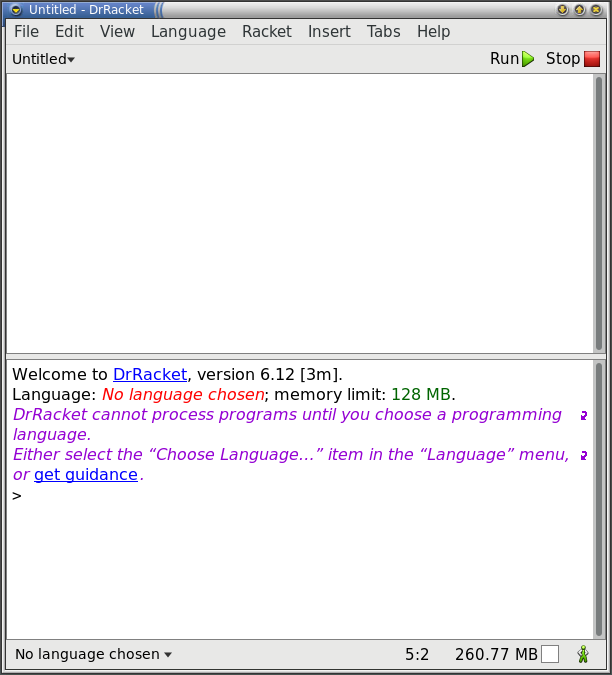
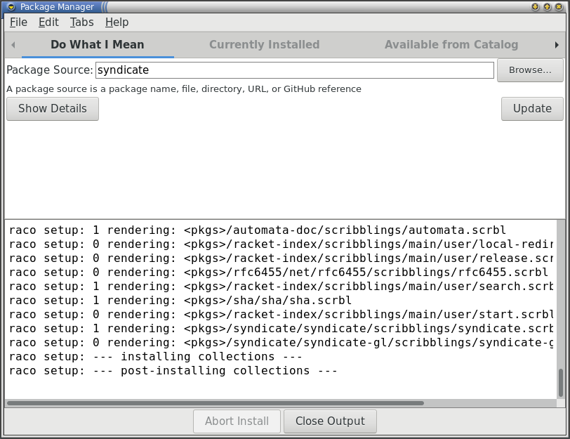
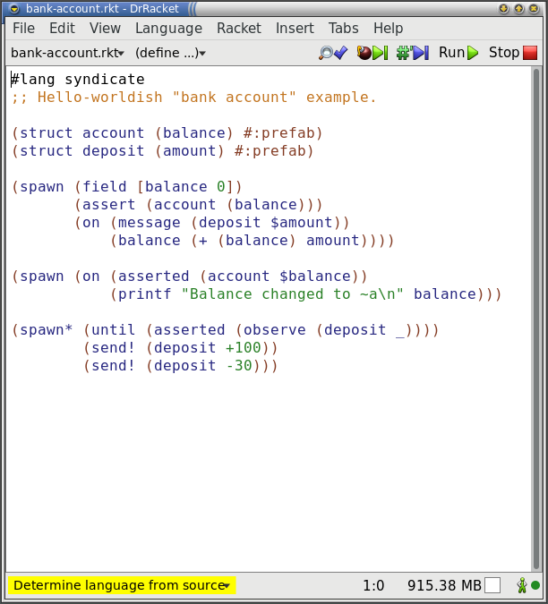
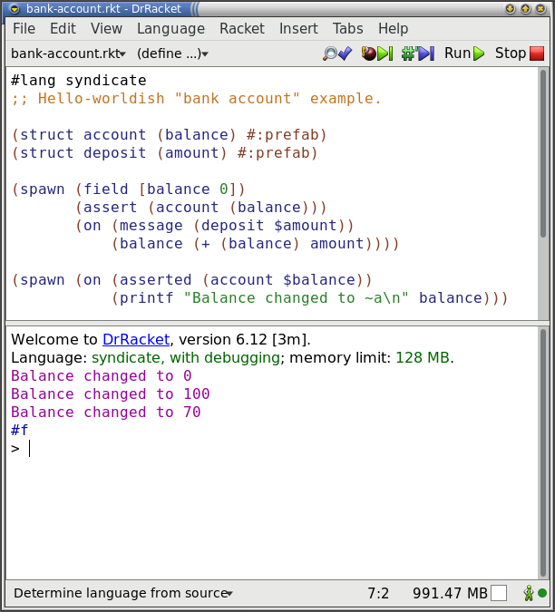
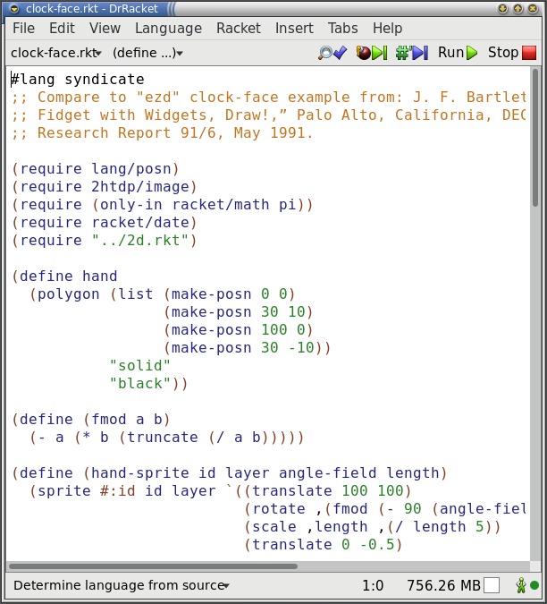
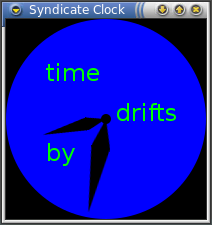

# Installation—Racket

There are two steps to installing Syndicate for Racket:

 1. Install Racket
 2. Install the Syndicate package using the Racket package manager

At that point, you can run example programs and develop your own.

## Racket

First, install Racket by following the
[instructions on `racket-lang.org`](http://racket-lang.org/).

After installation is complete, start DrRacket. From the Unix
command-line, run `drracket`.

## Syndicate

Choose the DrRacket `File`>`Package Manager...` menu item.

Type "syndicate" into the `Package Source` field, and click `Install`.

Once the installation has completed, close the `Package Manager`
window.

You can alternatively use the command-line to install the `syndicate`
package:

    raco pkg install --auto syndicate

## Running Examples

### ... from DrRacket

Try running a small non-graphical example in DrRacket: choose
`File`>`Open Require Path...` (also available by pressing
`Shit+Ctrl+O`), and type `syndicate/examples/actor/bank-account.rkt`
into the field at the top of the window that appears. Click `OK`.

You will be greeted with the source to `bank-account.rkt`. Click the
`Run` button.

Now try a small graphical example: choose `File`>`Open Require
Path...` again, and this time, type
`syndicate-gl/examples/clock-face.rkt` before clicking `OK`.

You will be greeted with the source to `clock-face.rkt`. Click the
`Run` button. After a moment, the following window should appear. The
hands of the clock are draggable; press `q` to close the window.

### ... from the command line

You can also run these examples from the command line. The bank
account example can be run as follows:

    $ racket -l syndicate/examples/actor/bank-account
    Balance changed to 0
    Balance changed to 100
    Balance changed to 70
    #f

The following command starts the `clock-face` program:

    $ racket -l syndicate-gl/examples/clock-face
